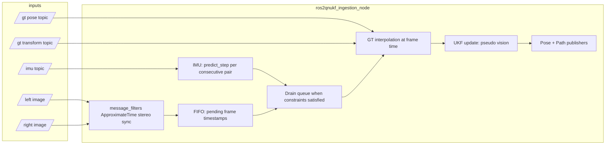

# ros2qnukf

ROS 2 (**Jazzy**) package: **non-deep QNUKF**-style visual–inertial estimation for dataset bringup (EuRoC-oriented). Core math mirrors the **non-AI** estimation path in **DeepUKF-VIN** (naming and structure); this package does **not** run learning or Python inference.

Reference trees elsewhere in the workspace (`DeepUKF-VIN/`, `open_vins/`, etc.) are for parity and ideas—implementations live in `ros2qnukf/`.

### Documentation note

Treat this file as the **working overview** of pipeline layout and parameters—keep it updated when behavior changes. Content here may still be wrong or stale in detail; **confirm anything safety- or correctness-critical against the source** (`ros2qnukf/src/`, `ros2qnukf/include/ros2qnukf/`).

---

## Architecture

### High-level pipeline



### Timing and scheduling (OpenVINS-style queue)

Stereo pairs **do not** run the UKF update in the image callback alone. Each sync event pushes **`frame_stamp = max(left_stamp, right_stamp)`** onto **`pending_stereo_frame_stamps_`** (bounded by **`stereo_queue_max`**; oldest dropped if full).

**`drain_pending_stereo_frames_locked()`** runs **after**:

- each IMU message (predict + history trim),
- each GT pose / transform message (history trim),

and repeatedly tries the **front** of the queue with **`try_process_stereo_frame`**. A frame is **skipped until later** (queue head stays blocking) when:

- the filter is not initialized yet,
- **`imu_history_.back().stamp < frame_stamp + cam_to_imu_dt_sec`** (IMU stream has not reached the camera-aligned IMU time—no timestamp slack),
- interpolated GT at **`frame_stamp`** is unavailable (**needs at least one** GT pose in history; **two** samples preferred for interpolation between times).

This avoids loosening time alignment while handling IMU/image callback ordering under load.

### Prediction vs update

| Phase | When | What |
|--------|------|------|
| **Predict** | Every new IMU sample **after** initialization, when **`imu_history_.size() ≥ 2`** | **`QnukfFilter::predict_step(prev, curr)`** integrates state between consecutive IMU stamps. |
| **Update** | Only when a queued stereo frame is **drained** successfully | Build **pseudo vision** from interpolated GT → **`update_pseudo_vision`**. |

**`predict_batch`** remains on **`QnukfFilter`** for reuse/tests; live ingestion uses **per-IMU `predict_step`** only.

### Ground truth for initialization and pseudo measurements

- **`gt_pose_topic`** and **`gt_transform_topic`** append into one chronologically trimmed **`gt_history_`** (same frame as **`gt_lookup_max_dt_sec`** / history window naming).
- **`lookup_gt_pose_interpolated(stamp)`** requires **at least two** GT samples: **linear interpolation** for position, **spherical linear interpolation (slerp)** for orientation between neighbors. Extrapolation uses the same two-sample segment when **`stamp`** is slightly outside the bracket (implementation-defined endpoints).
- **Initialization:** On the **first** IMU sample, if interpolated GT exists at that IMU time, **`initialize_from_pose`** uses it; otherwise the filter starts at **origin + identity orientation** (warning throttle) until GT-backed behavior is possible.

### `QnukfFilter` (core UKF)

- **Nominal state (16-D vector internally):** orientation quaternion, position, velocity, gyro bias, accel bias.
- **Error state:** **15** dimensions (standard IMU navigation error parametrization).
- **Initial covariance `P0` (on `initialize_from_pose`):** block-diagonal `diag(900·I₃, 60·I₃, 10·I₃, 0, 0)` on attitude, position, velocity, gyro bias, accel bias—same as `DeepUKF-VIN/QUKF_main3.py` `P0` (zero blocks for both bias subspaces).
- **Prediction:** Unscented transform on IMU kinematics; **augmented state** (**21**-D error) carries gyro/accel noise terms for stochastic propagation (`kAugmentedDim` / `kAugmentedErrorDim` in code). Quaternion mean uses weighted averaging after sigma propagation.
- **Pseudo vision update:** Full UKF measurement update mirrored from DeepUKF-VIN: transform each predicted sigma state through pseudo-vision measurement model, compute **`zhat`**, **`Pz`**, **`Pxz`**, then apply **`K = Pxz * pinv(Pz)`** with covariance update **`P = P - K * Pz * K^T`**. **`pseudo_feature_count`** controls how many points participate.
- **Noise / UKF tuning** (defaults in `qnukf_filter.hpp`): gyro/accel measurement noise, bias random walk, gravity magnitude, **`ukf_alpha` / `ukf_beta` / `ukf_kappa`**. Matrix invariants in the UKF core now fail fast via exceptions instead of falling back to permissive numerics.

### Threading

**`ingestion_main.cpp`** uses **`MultiThreadedExecutor`** with **4** callback threads so IMU, stereo sync, and GT subscriptions overlap. All filter state, IMU/GT histories, pending stereo queue, and path message are guarded by **one mutex** **`data_mutex_`** (no separate filter lock).

### Outputs

- **`PoseStamped`** on every successful stereo update.
- **`nav_msgs/Path`**: optional **rate limit** via **`path_publish_period_sec`** (`0` = publish path every pose update). Internal path storage can still grow; tune if needed for long bags.

Update rate follows successful stereo drains (often close to camera frame rate on EuRoC-style bags when topics align).

---

## Dependencies

Declared in `package.xml`: **Eigen3**, **rclcpp**, **sensor_msgs**, **geometry_msgs**, **nav_msgs**, **message_filters**, launch stacks. Build: **ament_cmake**.

---

## Build

From your Colcon workspace root (directory containing `src/`):

```bash
source /opt/ros/jazzy/setup.bash
colcon build --packages-select ros2qnukf
source install/setup.bash
```

---

## Run

### Full launch (bag + node + RViz)

```bash
ros2 launch ros2qnukf ros2qnukf_ingestion.launch.xml
```

**Defaults are examples:** `bag_path` in the launch file points at **`/home/kash/datasets/$(var dataset)`** and **`rviz_config`** is a developer path. Override for your machine, e.g.:

```bash
ros2 launch ros2qnukf ros2qnukf_ingestion.launch.xml \
  bag_path:=/path/to/your/V2_01_easy \
  rviz_config:=/path/to/ros2qnukf/config/ros2qnukf_display.rviz
```

Common launch arguments:

| Argument | Role |
|----------|------|
| `dataset` | Folder name appended if you customize `bag_path` around it (default `V2_01_easy`). |
| `bag_path` | Full path to the ROS 2 bag directory. |
| `bag_rate`, `bag_start` | Playback rate and start offset (seconds). |
| `params_file` | Ingestion node YAML parameter file (default `config/ros2qnukf_ingestion.params.yaml`). |
| `bag_enable` | `false` to skip `ros2 bag play` (bring your own publishers / clock). |
| `use_sim_time` | Keep **`true`** for bag playback with `/clock`. |
| `rviz_enable` | `false` to skip RViz. |
| `debug` | Reserved diagnostics flag. Kept for interface parity, but verbose debug logging is removed. |
| `gt_from_csv_enable` | Launch built-in GT CSV publisher (`/ov_msckf/posegt`, `/ov_msckf/pathgt`). |
| `path_gt_csv` | GT CSV path (default OpenVINS EuRoC CSV using `dataset`). |
| `gt_csv_publish_rate_hz` | GT CSV publish rate in Hz. |
| `init_bias_from_gt_csv` | If true, initialize filter `b_w`/`b_a` from GT CSV dataset means (`b_w_*`, `b_a_*`). |
| `path_publish_period_sec` | Path throttle; **`0`** = every pose update. |
| `stereo_queue_max` | Max pending stereo timestamps (default **512**). |
| `estimate_pose_cov_topic` | PoseWithCovariance output topic, used by GT realign helper node. |
| `initial_realign_enable` | Run `initial_pose_realign_node` to publish GT aligned to estimate frame. |
| `gt_aligned_pose_topic`, `gt_aligned_path_topic` | Output topics for aligned GT pose/path used in RViz comparison. |
| `gt_align_*` | Alignment controls (`type`, association dt, min/lock pairs, TF publish + frame names). Default TF parent is `world` for RViz visibility with `Fixed Frame: world`. |

Example:

```bash
ros2 launch ros2qnukf ros2qnukf_ingestion.launch.xml \
  debug:=true bag_rate:=1.0 bag_path:=/data/euroc/V2_01_easy
```

### Node only

```bash
ros2 run ros2qnukf ros2qnukf_ingestion_node --ros-args -p debug:=true
```

Ensure **`use_sim_time`** and **`/clock`** if playing a bag.

### Quick verification

After launch with a suitable bag:

```bash
ros2 topic hz /ros2qnukf/pose_estimate
ros2 topic echo /ros2qnukf/pose_estimate --once
```

---

## Node parameters

| Parameter | Default | Role |
|-----------|---------|------|
| `imu_topic`, `left_image_topic`, `right_image_topic` | EuRoC-style (`/imu0`, `/cam0/image_raw`, `/cam1/image_raw`) | Inputs. |
| `gt_pose_topic`, `gt_transform_topic` | See launch | GT merged into one history for interpolation + pseudo measurement. |
| `gt_from_csv_enable`, `path_gt_csv`, `gt_path_topic`, `gt_csv_publish_rate_hz` | `true`, OpenVINS EuRoC CSV default, `/ov_msckf/pathgt`, `60.0` | Optional GT source when bag has no GT topic. |
| `init_bias_from_gt_csv` | `true` | Mirrors DeepUKF-VIN init style by setting initial IMU biases from GT CSV means when CSV is available. |
| `gyro_noise_stddev`, `accel_noise_stddev`, `gyro_bias_rw_stddev`, `accel_bias_rw_stddev` | `2.399e-3`, `2.828e-2`, `1.371e-6`, `2.121e-4` | QNUKF process-noise terms (from YAML by default). |
| `initial_covariance_diagonal` | 15x `0.1` | Initial 15D state covariance diagonal used on filter initialization. |
| `estimate_pose_topic`, `estimate_pose_cov_topic`, `estimate_path_topic` | `/ros2qnukf/pose_estimate`, `/ros2qnukf/pose_estimate_cov`, `/ros2qnukf/path_estimate` | Outputs. |
| `cam_to_imu_dt_sec` | `0` | **`t_imu_target = frame_stamp + dt`** for the IMU coverage check. |
| `stereo_queue_max` | `512` | Max queued frame timestamps. |
| `stereo_sync_queue_size` | `15` | Approximate-time sync queue for left/right images. |
| `sensor_qos_depth` | `10` | Subscriber history depth for sensor QoS. |
| `path_publish_period_sec` | `0` | Path publish throttle (pose still every successful update). |
| `pseudo_feature_count`, `pseudo_noise_stddev` | `20`, `0.02` | Pseudo measurement count / noise scale. |
| `publish_gt_feature_markers`, `gt_feature_markers_topic`, `gt_feature_marker_diameter`, `gt_feature_markers_publish_hz` | `true`, `/ros2qnukf/gt_feature_points`, `0.12`, `5.0` | Fixed landmarks published on a **ROS timer** (default 5 Hz), independent of stereo / filter; uses node clock (`use_sim_time` OK). Disable with `publish_gt_feature_markers:=false`. |
| `publish_pseudo_measurement_markers`, `pseudo_measurement_markers_topic`, `pseudo_measurement_marker_diameter` | `true`, `/ros2qnukf/pseudo_measurements_gt`, `0.08` | Per-stereo pseudo measurements (`body_points`) transformed to `world` using interpolated GT pose for RViz inspection of update inputs in GT frame. |
| `imu_history_sec` | `2.0` | GT history trim horizon (`gt_history_` retention window). IMU history trim is consumption-based (drop all samples older than newest predicted sample). |
| `gt_lookup_max_dt_sec` | `0.25` | GT history trim horizon. |
| `pseudo_pose_when_no_gt` | `false` | If **true**, when no GT pose is available at frame time the node uses **current filter state** as the synthetic “GT” for pseudo vision (IMU/smoke-test only; not for benchmark accuracy). |
| `camera_qos_reliable` | `false` | If **true**, stereo image subscriptions use **reliable** QoS instead of sensor-style best-effort — try if synchronized stereo never arrives from your bag. |
| `use_stereo` | `true` | If false, stereo sync is not used (see code paths). |
| `debug` | `false` | Reserved diagnostics flag (currently minimal effect). |

### No `/ros2qnukf/pose_estimate` output?

The update step requires **pseudo vision**, which uses **ground truth pose** sampled from **`gt_pose_topic`** and **`gt_transform_topic`**. Defaults (`/ov_msckf/posegt`, `/vicon/...`) match **OpenVINS-style** overlays and **some** EuRoC Machine Hall bags — they are **often wrong** for a bare EuRoC ROS 2 bag.

1. Inspect the bag: `ros2 bag info /path/to/bag` — find `geometry_msgs/msg/PoseStamped` or `TransformStamped` topics for truth.
2. Relaunch with remaps, e.g.  
   `gt_pose_topic:=/your/truth/pose gt_transform_topic:=`  
   (`gt_transform_topic` empty disables that subscription.)
3. With **`debug:=true`**, watch the console for throttled **`ros2qnukf:`** messages (**not initialized**, **IMU behind camera frame**, **no ground truth**, etc.).
4. Quick pipeline check without GT remap: **`pseudo_pose_when_no_gt:=true`** (expect warnings; poses track propagation + noisy self-consistency only).

Interpolation uses **two neighboring GT samples** when available; with **one** GT message the node uses that pose for all frames until more data arrives.

---

## Topics published

| Topic | Type | Notes |
|-------|------|--------|
| `estimate_pose_topic` | `geometry_msgs/msg/PoseStamped` | Filter pose. |
| `estimate_path_topic` | `nav_msgs/msg/Path` | Trajectory; may be throttled. |
| `gt_feature_markers_topic` (see params) | `visualization_msgs/msg/MarkerArray` | **Noise-free** synthetic `pseudo_world_points_` in **`world`** (SPHERE_LIST); republished on **`gt_feature_markers_publish_hz`** timer, not on filter updates. |
| `pseudo_measurement_markers_topic` (see params) | `visualization_msgs/msg/MarkerArray` | Pseudo measurement points projected into `world` from `body_points` with interpolated GT pose each successful stereo update. |
| `gt_aligned_pose_topic` | `geometry_msgs/msg/PoseStamped` | Published by optional initial realign node when enabled. |
| `gt_aligned_path_topic` | `nav_msgs/msg/Path` | Aligned GT trajectory in estimate frame. |

Default **`frame_id`** for outputs: **`world`**.

---

## Debug flag (`debug` parameter)

The `debug` parameter is still part of the node interface and is forwarded to `QnukfFilter::set_debug` for compatibility. Script-style debug logging and debug-only console print blocks were removed to keep runtime output clean.
